# Documentation-ActiveDirectoryDomainController-DnsServer
Hub &amp; Spoke AD DC &amp; DNS Server

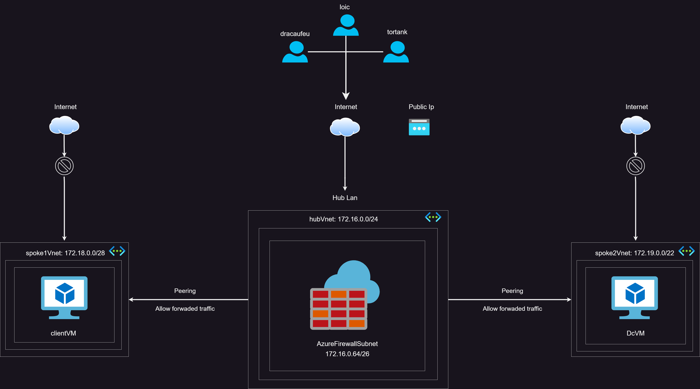

# 
1. Prérequis : 

* __Réseau__  
  
   - `Peering: dans les deux Vnets des Spokes Cocher Allow dans peering pour l'option Traffic Forwaded From Remote Virtual Network afin de connecter et autoriser les applications et services à s'authentifier à travers le domain controler.`  
  
   - `L'adresse Ip de la NIC du Domain Controler doit être en Static.`  
   
   - `Dans Chaque Spoke il faut définir le DNS sur Custom et ajouter Ll'adresse Ip de la NIC du Domain Controler.`

* __Dans le Domain Controler__  
   
   - ` S'assurer de choisir une extension de domaine peu utilisée, par exemple: exemple.lan, exemple.lab` 

* __les Rules__  
 __https://learn.microsoft.com/en-US/troubleshoot/windows-server/identity/config-firewall-for-ad-domains-and-trusts__  
  
  - `S'inspirer des Rules de la doc officiel afin de faciliter la connexion de la VM (Client) à la VM (DomainControler).`

# 
2. Manipulations sur les VMs et le Firewall. 
 

* __Créer les VMs__   
  
  - `On Bloque tous les inbounds ports (3389, 80, 443, 22) afin de gérer les options de connexions à travers le firewall.`  
  
  - `Pas d'adresse Ip public ni NSG.`
  
  - `on passe l'adresse ip NIC de la VM Domain Controler de Dynamic à Static.`
    
    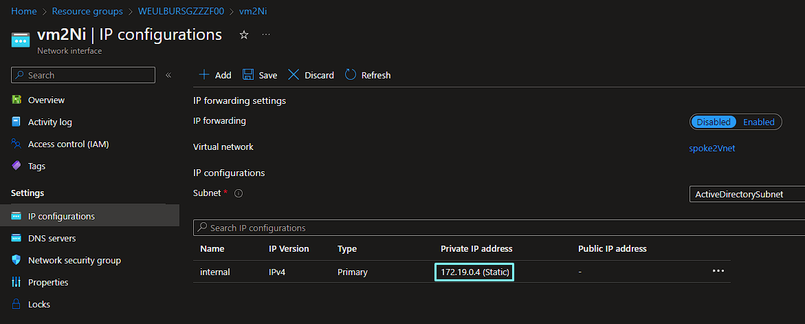

* __DNS dans les Vnets__  
  
  - `Dans les deux différents Spokes on définit le DNS Servers sur custom dans DNS Servers et on y ajoute l'adresse ip NIC de la VM Domain Controler.`
    
    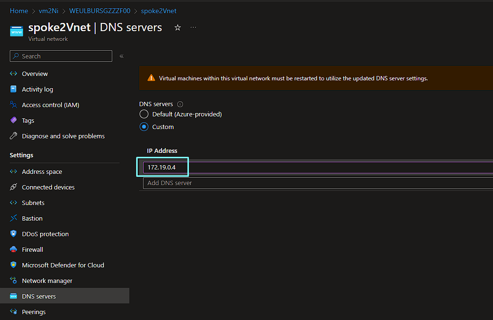

* __Redémarrer les VMs__  

* __Firewall__  
 __https://learn.microsoft.com/en-US/troubleshoot/windows-server/identity/config-firewall-for-ad-domains-and-trusts__  
  
  - `Dans le Firewall créer une collection de network rules et ouvrir tous les ports dans la doc de l'adresse IP de la VM client à l'adresse IP de la VM domain controller`  
  
  - `Rajouter les rules DNAT pour la connexion aux VMs en RDP`
  
  - `Rajouter les APPLICATIONS RULES pour donner accès à internet aux deux VMs`
    
    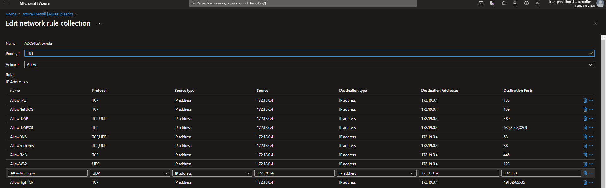

# 
3. Manipulations dans la VM Domain Controler.

* __Vérification__   
  
  `Vérifier que l'adresse IP du DNS Server est la même que l'adresse ip NIC de la VM Domain Controler.`  
    
    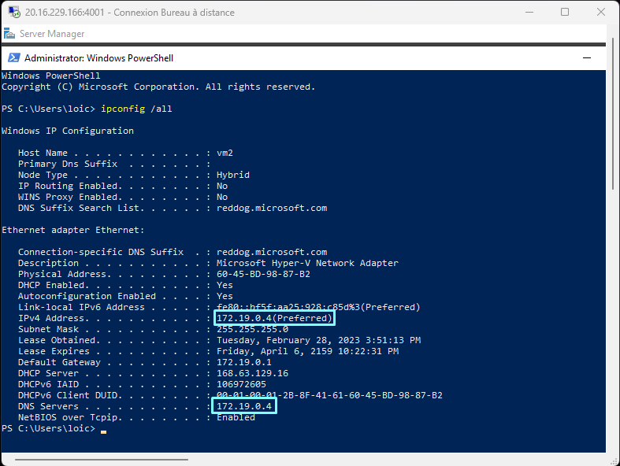

* __Ajout du Domain Controler et du DNS Server__   
  
  - `Dans le Server Manager ajouter le Domain Controler ainsi que le DNS server.`  

  
  - `Une fois terminé il faut promouvoir le Server afin qu'il soit utiliser par le domain controler.`
    
    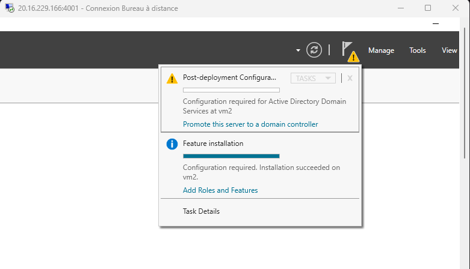
        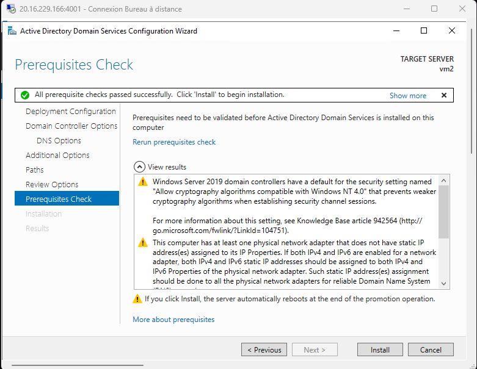

  - `La VM du Domain Controler va ainsi être redemarrée .`  
  - `On peut se reconnecter .`  

* __Dernière Vérifications__   
  
  - `Lors de la connexion vérifier que le nom du domaine controller apparaît dans le nom de la VM.`  

  
  - `Eventuellement faire un nslookup nomdudomainecontroler , un ping sur l'adresse IP dU domaine controler et aussi un tracert sur l'adresse IP du domaine controler .`  
      
    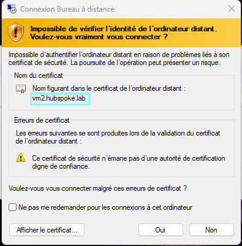
        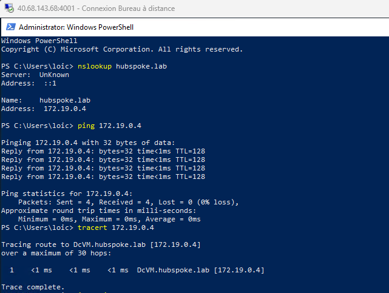

# 
4. Manipulations dans la VM Client.
  

* __Vérifications__  
  
  - `Faire les mêmes vérifications que dans la VM Domaine Controler, l'adresse IP doit être la même.`

* __Ajout de la VM client au Domaine Controler__  
  
  - `Ouvrir l'explorateur des fichiers et faire un clic droit sur propriété .`  
  - `Rajouter le nom de domaine et les identifiants de connexion.`
    
    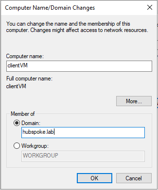
        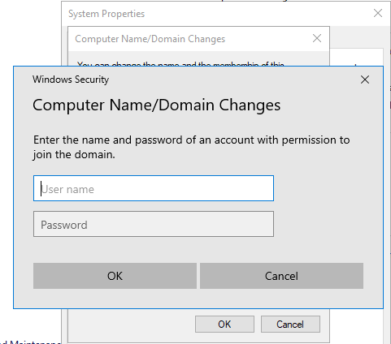
            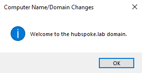
                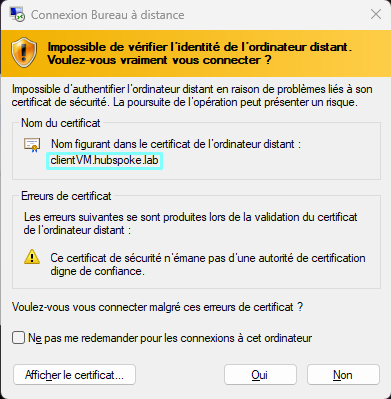

# 
5. Ajout des deux pokémons. 
 

  - `Dans tools sélectionner Users & computers .`
    
    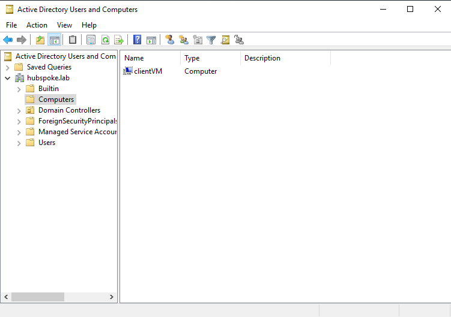
        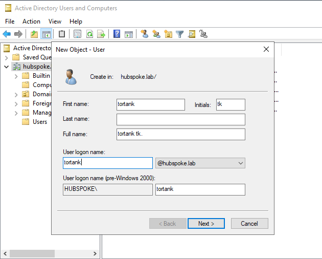  

     `Se connecter à la VM client avec les identifiants de l'un des Pokémons .`  

# 
6. Quelques liens utiles 

  - __https://infosecwriteups.com/active-directory-overview-98692e1b0233__  
  - __https://www.rebeladmin.com/2018/06/active-directory-authentication-works/__
